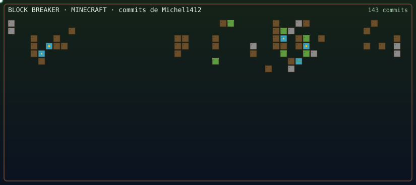
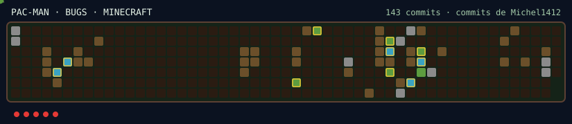

<!-- Perfil GitHub · Versão 4 · Linux TTY + Grass Block · Michel Bocchi Junior -->

<p align="center">
  
</p>

<p align="center">
  
  
  
  
  
  
</p>

---

```text
michel@github:~$ neofetch

     ________________    michel@github
   /################/|   -------------
  /################/ |   OS: Engenharia de Software · formatura 2026
 /################/  |   Host: Maringá, Paraná, Brasil
/________________/   |   Kernel: Java · Node.js · Go · Spring Boot
|::::::::::::::::|   |   Shell: Linux · Bash · kubectl
|::::::::::::::::|   |   Uptime: 2+ anos em produção na PlugLead
|::::::::::::::::|   |   Packages: Redis Streams · RabbitMQ · k8s
|::::::::::::::::|   |   Payments: APIs de pagamento
|::::::::::::::::|   |   Cloud: Railway (já usei em prod)
|::::::::::::::::|   |   Item: Grass Block
|::::::::::::::::|   |   WM: Minecraft · nick Chelzinho
|::::::::::::::::|  /    Agent: Cursor (main-agent)
|::::::::::::::::| /     Side quest: co-founder @RedeNerd
|::::::::::::::::|/      Chat: WhatsApp Business API @ pluglead.com
|________________|       Status: compiling the next commit
```

```bash
michel@github:~$ whoami
Michel Bocchi Junior — desenvolvedor back-end. In-game: Chelzinho.

michel@github:~$ cat /etc/motd
Construo APIs, streams e clusters. De dia, mensagens
saem no WhatsApp pela PlugLead — e o PIX também.
De noite, o mundo é bloco, pickaxe e um terminal aberto.

michel@github:~$ systemctl status carreira
● pluglead.service     loaded active running  automação WhatsApp · 2+ anos
● payments.service     loaded active running  integração com APIs de pagamento
● streams.service      loaded active running  Redis Streams · RabbitMQ
● k8s.service          loaded active running  Docker · Kubernetes · Railway
● faculdade.service    loaded active running  Engenharia de Software · 2026
● redenerd.service     loaded active running  co-founder · nick Chelzinho
● cursor.service       loaded active running  main-agent · Cursor
● linux.service        loaded active running  terminal, ssh, git
```

---

## `$ cat about.md`

Sou o **Michel**. Trabalho há **2+ anos** na [**PlugLead**](https://pluglead.com) — plataforma de automação de WhatsApp com chatbot, campanhas, API oficial da Meta e **integração com APIs de pagamento**.

Estou na reta final da faculdade de **Engenharia de Software** (formatura em **2026**). No dia a dia: **Java**, **Node.js**, **Go**, **Spring**, **Redis Streams**, **Kubernetes** e design patterns de verdade, não só de slide. Já subi coisa no **Railway**. Meu **main-agent** é o **[Cursor](https://cursor.com)**.

Fora do `crontab`: **Linux**, programação e **Minecraft** — sou co-founder da **@RedeNerd**, nick **Chelzinho**.

---

## `$ ./commits --last-year --play`

O gráfico de contribuições do último ano vira jogo. O GitHub **não deixa JavaScript no README**, então aqui o SVG joga sozinho — não tem como pegar o teclado nesta página.

<p align="center">
  
</p>

<p align="center">
  
</p>

<p align="center"><sub>tijolos = dias com commit · grass block no boot · tema <code>minecraft</code> · o automático joga no próprio perfil · gerado por <a href="https://github.com/Michel1412/commit-craft">commit-craft</a></sub></p>

---

## `$ ./stats.sh`

<p align="center">
  
  
</p>

<p align="center">
  
</p>

<p align="center">
  
</p>

---

## `$ pacman -Q stack`

<p align="center">
  
</p>

<p align="center">
  
  
  
  
  
</p>

| camada | o que roda |
| --- | --- |
| **runtime** | Java · Node.js · Go · Spring Boot |
| **mensageria** | Redis Streams · RabbitMQ · filas · eventos |
| **ops** | Linux · Docker · Kubernetes · GitHub Actions · Railway |
| **agent** | **Cursor** · main-agent |
| **produto** | WhatsApp · chatbot · API oficial Meta · APIs de pagamento |
| **side quest** | Minecraft · co-founder **@RedeNerd** · nick **Chelzinho** · `commit-craft` |

---

## `$ ls ~/work`

### [PlugLead](https://pluglead.com) — desenvolvedor de software · 2024 → hoje

Sistema de automação de **WhatsApp**: atendimento, chatbot, disparos, integrações e **APIs de pagamento**. Aplico design patterns, arquitetura e containers no que a faculdade só mostrou no quadro.

- APIs e back-end em **Java**, **Node.js** e **Go**
- Mensageria com **Redis Streams** e RabbitMQ
- **Docker**, **Kubernetes** e deploys que já passaram pelo **Railway**
- **Cursor** como main-agent no fluxo de código
- rotinas que precisam aguentar volume — mensagem, fila e PIX no mesmo pipeline
- produto usado por empresas que vendem e atendem no WhatsApp

### Engenharia de Software — formatura 2026

Reta final. O diploma é o próximo `systemctl enable`.

### Side quest — co-founder @RedeNerd · nick Chelzinho

Fora do horário comercial eu não só jogo: ajudei a **fundar** o servidor **@RedeNerd**. In-game respondo por **Chelzinho**. Farm, plugin, comunidade, backup — o mesmo instinto de ops, outro bioma.

---

## `$ ls ~/projects`

| repo | o que é |
| --- | --- |
| [**commit-craft**](https://github.com/Michel1412/commit-craft) | Action que transforma o ano de commits em Block Breaker / Pac-Man |
| [DEA-blog](https://github.com/Michel1412/DEA-blog) | blog · TypeScript · [dea-blog.vercel.app](https://dea-blog.vercel.app) |
| [damas](https://github.com/Michel1412/damas) | jogo de damas no browser |
| [games_api](https://github.com/Michel1412/games_api) | API em **Go** — backend/dados para app da faculdade |

---

## `$ cat ~/TODO`

```text
[ ] mestrado — a busca começa depois do diploma
[ ] montar um modpack de Minecraft
[ ] sonho: software-house ou estúdio de games
```

---

## `$ cat ~/.config/hobbies.conf`

```ini
[world]
game      = Minecraft
nick      = Chelzinho
server    = @RedeNerd   ; co-founder
mode      = survival / criativo, depende do dia
chat      = WhatsApp — mas o cliente é da PlugLead
os        = Linux
cloud     = Railway, já usei
item      = grass_block     ; Minecraft
editor    = Cursor
agent     = Cursor          ; main-agent
```

---

## `$ ./connect.sh`

<p align="center">
  <a href="https://github.com/Michel1412"></a>
  <a href="https://pluglead.com"></a>
  <a href="https://www.linkedin.com/in/michel-junior-275127272"></a>
  <a href="https://instagram.com/_bocchi_michel"></a>
</p>

---

## `$ tail -f /var/log/study.log`

Tecnologia que estou estudando **agora**:

- **Agents de IA** — main-agent: **[Cursor](https://cursor.com)**
- **Arquiteturas com ADRs estruturais**
- **Telemetria · OpenTelemetry**

```bash
michel@github:~$ echo "next up: diploma 2026 && keep shipping"
next up: diploma 2026 && keep shipping
```

---

## `$ fortune`

> *“Senhor, não sou digno de que entreis em minha morada, mas dizei uma palavra e eu serei salvo.”*
>
> — [Mateus 8,8-12](https://www.bible.com/pt/bible/129/MAT.8.8-12)

> *“Faça o teu melhor na condição que você tem, enquanto você não tem condições melhores para fazer melhor ainda.”*
>
> — Mario Sergio Cortella · [pensador.com](https://www.pensador.com/frase/MjAyMTg3MQ/)
